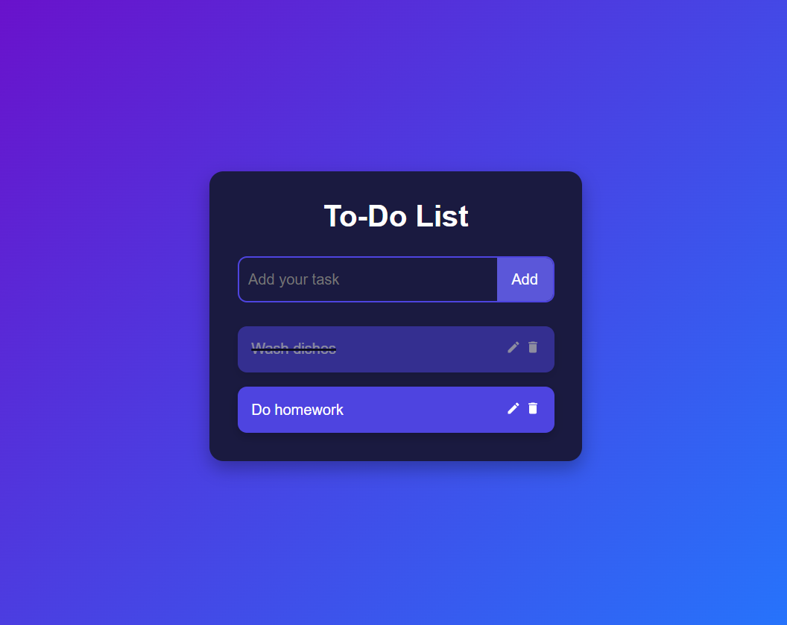

# **To do List Application**

## **Project Overview**
This Todo List Application provides users with an interactive and visually appealing way to manage their daily tasks. It is built using React.js, showcasing a modular design through well-structured components, including features like task creation, completion toggling, editing, and deletion. The CSS styling ensures a clean, dark-themed UI with smooth transitions.

---

## **Features**
- **Interactive UI**:  
  - Tasks can be clicked to mark as complete or opened for editing.
- **Real-time Updates**:  
  - Tasks update instantly with React's state management.
- **Dark-Themed Design**:  
  - Uses CSS to enhance the user experience with smooth transitions and hover effects.
- **Prop Validation**:  
  - Uses PropTypes to ensure type safety for component properties.
- **Component-based Structure**: 
  - Modular code that improves scalability and readability.

---

## **To-Do-List-App**
```
Employee-Management-System/  
│  
├── src/                           # Source code files  
│   ├── components/                # Folder for React components
│   │   ├── CreateForm.jsx         # Component for creating new tasks
│   │   ├── EditForm.jsx           # Component for editing existing tasks
│   │   ├── Todo.jsx               # Component for rendering a single todo item with edit/delete functionality
│   │   └── TodoWrapper.jsx        # Main component managing state and logic of all tasks        
│   ├── App.css                    # CSS file for global styling
│   ├── App.jsx                    # Main React component rendering TodoWrapper
│   ├── index.css                  # CSS for styling the entry point of the app
│   └── main.jsx                   # Entry point for rendering the app in the DOM
├── package.json                   # Contains project dependencies and scripts
├── package-lock.json              # Locks the specific versions of installed dependencies
├── README.md                      # Project documentation (this file)
└── .gitignore                     # Ignore unnecessary files 
```
 
---

### **Installation**
To run the project locally, follow these steps:
1. Clone the repository:
   ```
    git clone https://github.com/guan-wei-huang31/To-Do-List-App.git
    cd To-Do-List-App
   ```
2. Install dependencies:
   ```
   npm Install
   ```
3. Start the development server:
   ```
   npm run dev
   ```
   
## **Usage**
1. **Add a Task**:
   - Type the task name in the input field and click the Add button.
2. **Mark a Task as Completed**:
   - Click on a task to toggle between completed and uncompleted states.
3. **Edit a Task**:
   - Click the edit icon (✏️) to modify a task. Submit changes by clicking Done.
4. **Delete a Task**:
   - Click the delete icon (🗑️) to remove a task from the list.

## **Technologies Used**
- **React.js**: For building the user interface.
- **PropTypes**: For validating component props.
- **CSS3**: For styling and transitions.
- **React Icons**: For displaying icons like edit and delete.

---

### **FAQ**
1. Why can’t I add an empty task?
   - The application requires some text input to add a task. Ensure that you enter valid content before clicking Add.
2. How do I edit a task without marking it as completed?
   - Click the edit icon (✏️) instead of clicking on the task itself to avoid triggering the completion toggle.
3. Can I undo a deleted task?
   - Currently, there is no undo functionality. Once a task is deleted, it cannot be restored.
4. How do I prevent accidental task deletion?
   - The delete icon requires a separate click event to minimize the chance of accidental deletions. However, implementing an undo feature is part of the future plans.
   
### **Future Plans**
- **Undo Feature**: Adding an undo option to restore recently deleted tasks.
- **Filter Tasks**: Allow users to filter tasks by their status (e.g., Completed, Pending).
- **Drag and Drop Sorting**: Enable tasks to be rearranged through drag-and-drop functionality.
- **Dark/Light Mode Toggle**: Provide users the option to switch between dark and light themes.
- **Persistent Storage**: Integrate localStorage or a backend to store tasks across sessions.

### **Demo**
1. To Do List App:  
   
   
### **Contact**
For questions or suggestions, feel free to contact:  
Email: gwhuang24@gmail.com

### **Conclusion**
This Todo List Application is a lightweight and effective tool for managing daily tasks. Its simple yet functional design demonstrates the power of React.js in building modular, interactive web applications. With future enhancements such as undo features and persistent storage, the project aims to offer even greater flexibility and usability to users.